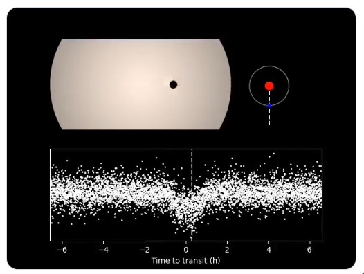

# Exoplanet of the Day

## Quickstart
 
    cp keys.py.template keys.py
    # modify keys.py with keys from https://developer.twitter.com/en/portal/projects/
    pip install -r requirements.txt
    python main.py test
    
## Systemd Unit

There is a systemd service to automatically run the script once per day.  Modify the paths in `exoday.service`, then install it with

    ln -rs exoday.service exoday.timer ~/.config/systemd/user
    systemctl --user daemon-reload
    systemctl --user enable --now exoday.timer
